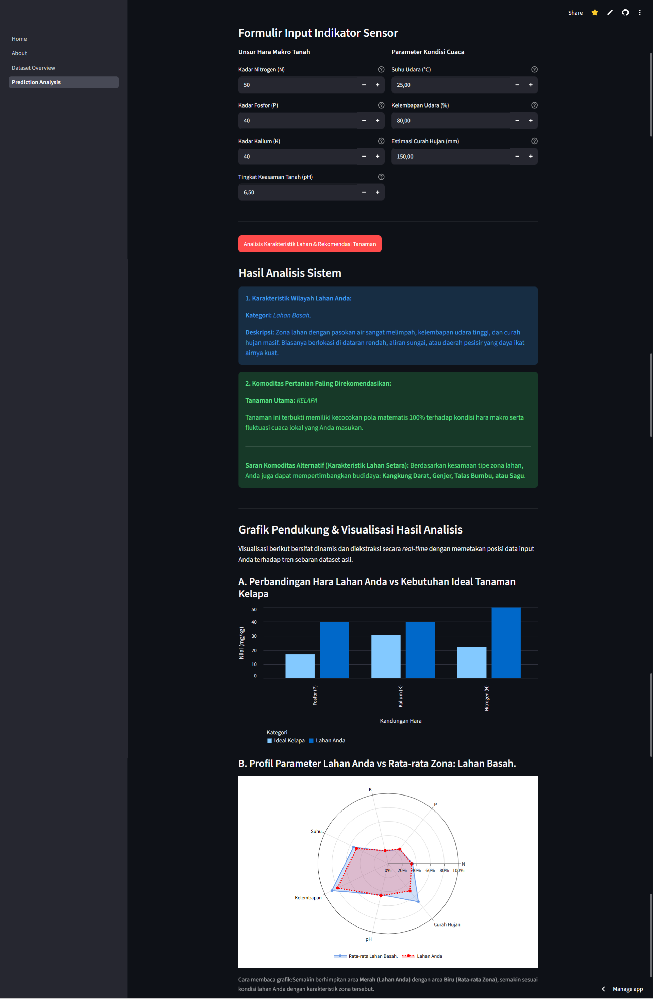
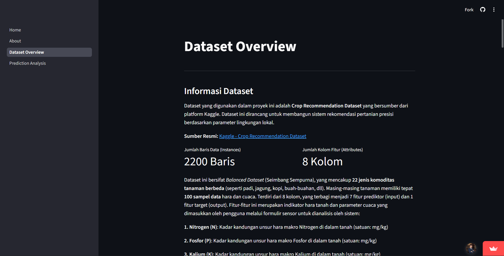
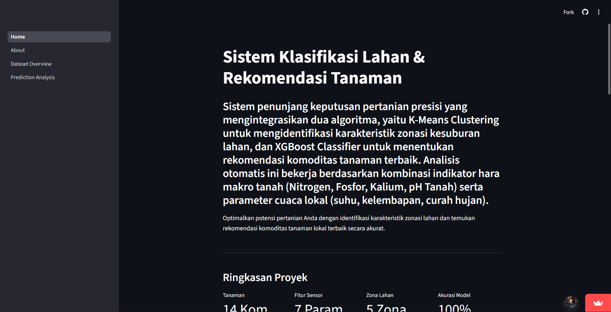

# Crop Classification & Recommendation System

An interactive web application that integrates Machine Learning to perform agricultural land zoning (K-Means Clustering) and automatically recommend the most optimal local crop commodities (XGBoost Classifier).


**[Live Demo](https://sistem-klasifikasi-lahan-dan-rekomendasi-tanaman.streamlit.app)** | **[Notebook](https://colab.research.google.com/drive/1HMleDvLFGSFsIY-kYyHPN8N2HvZgt7ML?usp=drive_link)** | **[Demo Video](https://youtu.be/-0C65rcOv14?si=BHrtVD0gCT5JIbj4)**

---

## Problem Statement

Indonesian farmers often rely on generational experience rather than scientific data when choosing crop commodities, leading to suboptimal land productivity and increased risk of crop failure. This project builds an intelligent decision-support system that classifies land characteristics and recommends the most suitable crops based on soil and weather sensor data.

---

## Preview

### Prediction Analysis


### Dataset Overview


### Home Page


## Key Findings

- **P and K nutrients are highly correlated (r = 0.86)**, meaning lands rich in phosphorus tend to also be rich in potassium — a key consideration in model selection.
- **5 distinct land zones** were identified through K-Means Clustering, each with unique agronomic characteristics:

| Zone | Name | Key Characteristics |
|------|------|-------------------|
| 0 | Dry Natural & Warm Tropical Land | Low N (21.12), low rainfall (90.64 mm) |
| 1 | Wetland / Paddy Field | Very high rainfall (207.64 mm), high humidity (89.03%) |
| 2 | Fertile Highland | Very high P (133.38), very high K (200.00) |
| 3 | Moderate Lowland | High N (65.71), low humidity (57.67%) |
| 4 | Alluvial / Sandy Land | Very high N (96.57), low rainfall (62.25 mm) |

- **XGBoost outperforms** Naive Bayes theoretically in this dataset due to its robustness against correlated features (P-K: 0.86), despite all three models achieving 100% accuracy.
- All 3 models achieved **100% accuracy** on 280 test samples across 14 crop classes.

---

## Tech Stack

| Category | Tools |
|----------|-------|
| Language | Python 3 |
| Web Framework | Streamlit |
| Machine Learning | Scikit-learn, XGBoost |
| Data Manipulation | Pandas, NumPy |
| Visualization | Matplotlib, Seaborn, Plotly, Altair |
| Model Serialization | Pickle |
| Training Environment | Google Colaboratory |

---

## Methodology (CRISP-DM)

```
Business Understanding → Data Understanding → Data Preparation
→ Modeling → Evaluation → Deployment
```

**Models compared:**

| Model | Accuracy | Notes |
|-------|----------|-------|
| Naive Bayes | 100% | Baseline — theoretically less suitable due to correlated features |
| Random Forest | 100% | Strong ensemble performer |
| **XGBoost** | **100%** | **Selected — best robustness & scalability** |

---

## Dataset

- **Source:** [Crop Recommendation Dataset — Kaggle](https://www.kaggle.com/datasets/atharvaingle/crop-recommendation-dataset)
- **Size:** 2,200 samples × 8 columns
- **Input Features:** N, P, K (soil nutrients), Temperature, Humidity, pH, Rainfall
- **Target:** 14 Indonesian local crop commodities (Rice, Corn, Banana, Mango, Watermelon, Orange, Papaya, Coconut, Coffee, Grape, Apple, Pomegranate, Melon, Mung Bean)
- **Missing values:** None

**Data Preparation steps:**
1. Filtered 22 original crop labels → 14 Indonesia-relevant commodities
2. Outlier removal using per-class IQR method
3. Label Encoding (LabelEncoder)
4. Feature Scaling (StandardScaler)

---

## System Workflow

```
User Input (7 sensor parameters)
        ↓
  Feature Scaling (StandardScaler)
        ↓
  K-Means Clustering → Land Zone Identification
        ↓
  XGBoost Classification → Crop Recommendation
        ↓
  Output: Zone + Recommended Crop + Visualization
```

---

## Project Structure

```
├── dataset/
│   ├── Crop_recommendation.csv
│   └── Crop_recommendation_clean.csv
├── notebook/
│   └── analysis.ipynb
├── model/
│   └── model_rekomendasi_tanaman.pkl
├── app/
│   ├── Home.py
│   ├── pages/
│   │   ├── Dataset_Overview.py
│   │   ├── Prediction_Analysis.py
│   │   └── About.py
│   └── assets/
│       ├── visualisasi_curah_hujan.png
│       ├── visualisasi_distribusi.png
│       └── visualisasi_korelasi_hara.png
|
├── requirements.txt
└── README.md
```

---

## Getting Started

**Option 1 — Access the live app directly:**
👉 [https://sistem-klasifikasi-lahan-dan-rekomendasi-tanaman.streamlit.app](https://sistem-klasifikasi-lahan-dan-rekomendasi-tanaman.streamlit.app)

**Option 2 — Run locally:**

```bash
# 1. Clone this repository
git clone https://github.com/lizamsabitm/Sistem-Klasifikasi-Lahan-Rekomendasi-Tanaman

# 2. Install dependencies
pip install -r requirements.txt

# 3. Run the app
streamlit run app/Home.py

# 4. Open browser at http://localhost:8501
```

> **Note:** If running locally, add `pickle5` to `requirements.txt`. This is not needed for Streamlit Cloud deployment (https://streamlit.io/).

---

## Requirements

```
streamlit
pandas
numpy
scikit-learn
xgboost
plotly
altair
matplotlib
seaborn
pickle5  # local only
```

---

## Academic Context

This project was developed as a final assignment for the Data Mining course, Information Systems Department, Universitas Negeri Surabaya (UNESA), 2026.
